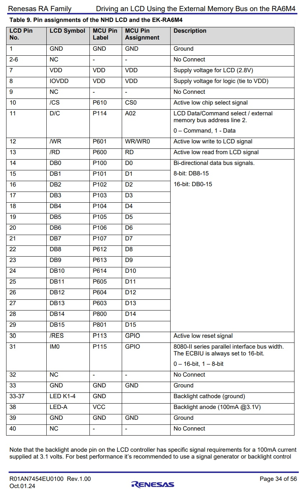

# Introduction #
This example project demonstrates the functionality of the LVGL running in partial frame buffer mode over the external bus to achieve a parallel interface with an LCD on the EK-RA6M4. The user can observe the frames per second, CPU, and RAM usage during several user triggered animations. Three separate screen tabs allow the user to observe three different types of animation, which showcases the resource usage and animation quality disparaties when using partial frame buffer. The user buttons on the EK-RA6M4 allow the user to change which tab they view, and when to trigger an animation. The transition between tabs is also an animation.

Please refer to the [Example Project Usage Guide](https://github.com/renesas/ra-fsp-examples/blob/master/example_projects/Example%20Project%20Usage%20Guide.pdf) for general information on example projects and [readme.txt](./readme.txt) for specifics of operation.

For further hardware and software setup for this demonstration, please see application note r01an7454eu0100.

## Required Resources ##
To build and run the LVGL Partial Frame Buffer example, the following resources are needed:

### Software ###
* Renesas Flexible Software Package (FSP): Version 5.6 or higher
* E2 studio: Version 2025-12 or higher
* SEGGER J-Link RTT Viewer: Version 8.92 or higher
* GCC Embedded Toolchain for ARM: version 13.2.1.arm-13-7

Refer to software requirements mentioned in [Example Project Usage Guide](https://github.com/renesas/ra-fsp-examples/blob/master/example_projects/Example%20Project%20Usage%20Guide.pdf)

### Hardware ###
Supported RA boards: EK-RA6M4
* 1 x Renesas EK-RA6M4 board.
* 1 x LCD Module (HD-2.8-240320AF-CSXP-F)
* 1 x Micro USB cable
* Jumper Wires (3" to 6")

### Hardware Connections ###

The user must wire the EK-RA6M4 to the LCD Module according to the following table:

## Related Collateral References ##
The following documents can be referred to for enhancing your understanding of the operation of this example project:
- [FSP User Manual on GitHub](https://renesas.github.io/fsp/)
- [FSP Known Issues](https://github.com/renesas/fsp/issues)
